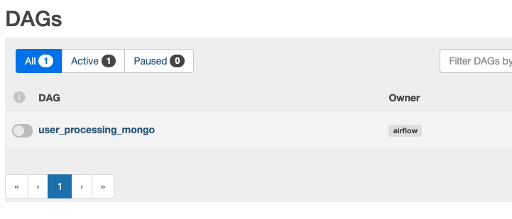

# Data ingestion into MongoDB from API

## Description
This simple pipeline is a quick Demo which shows some features of MongoDB as a NoSQL database,
in this process we comsume a public API of random users which provides json formated data and
after getting simple users information, it is ingested into MongoDB schema using Apache Airflow
as orchestrator. The whole data pipeline is implemented using Docker Compose.

## Requirements
- Docker installation up to date required, [Docker](https://docs.docker.com/get-docker/).
- Docker Compose installation, [Docker Compose](https://docs.docker.com/compose/install/).

## Process to follow
Once you have installed Docker and Docker Compose, you are ready to go. Download or clone this
repo into your local machine:

`git clone https://github.com/davidvemtz/Airflow_MongoDB_ingestion.git` 

Start Docker Desktop application.

Go to your repo root folder (where this readme can be found) and run the next command:

`docker-compose up --build`

Once your Python (with airflow installation and requirements ready), MongoDB and Mongo-Express
instances are running good, you can check using:

`docker ps`

You must see something like this:

With your containers running good, go to  to see Airflow login 
interface and use you user name as **airflow** and password **airflow** to login.

In order for the complete dag to run successfully execute next steps in order:

1. Unpause DAG in the toggle button beside DAG's name.

2. Create New Connection in order to provide access to airflow to randomuser API. It's important
for you to use the same name as the one shown in image, because it's already used in DAG's code.

    I. Go to Connections from Admin tab in Airflow UI. 

    II. After clicking in + button shown on the top of your connections list, fill needed fields,
    choosing HTTP connection type.

    III. Click Save button after filling correctly every needed field.

3. Select *mongo_default* connection to edit its properties as follows, use **admin** as Login and
password:

4. Trigger user_processing_mongo DAG from Airflow API.

5. Go to  in order to explore ingested data in dev-test schema.

